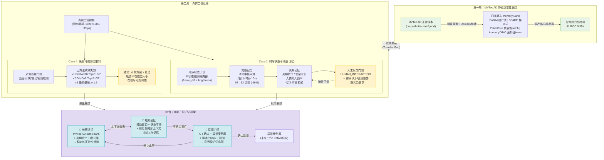

# 静态 Memory Bank → 动态 Memory 总览流程图

**Date**: 2026-06-21
**Usage**: 最终报告第5/8/12章 — 展示从MVTec AD静态记忆到真实工位动态记忆的完整演化路径

---

## Mermaid 流程图



## 关键路径说明

### 路径1 (Case 4): 采集质量门控
```
MVTec AD正常样本 → 静态Memory Bank → [迁移] → 真实工位视频
    → 采集质量门控 → 三方法收敛失效
    → 结论: 信号低于噪声地板 → 改进采集而非改进模型
```

### 路径2 (Case 2): 时序状态 + 人工反馈
```
MVTec AD正常样本 → 静态Memory Bank → [迁移] → 真实工位视频
    → 时序状态识别 (8 states) → 短期记忆(sliding window)
    → 长期记忆(周期统计/人类模式) → 人工反馈门控
    → 确认正常→纳入长期记忆 | 确认异常→异常案例库
```

### 路径3: 类脑整合
```
长期记忆 ←→ 短期记忆 (上下文查询)
短期记忆 → 反馈门控 (不确定事件上报)
反馈门控 → 长期记忆 (确认正常→巩固)
反馈门控 → 异常案例库 (确认异常→独立存储)
```

## 本图的关键论点

1. **MVTec AD 静态 memory bank 是有效但有限的** — AUROC 0.98+ 仅证明在受控条件下的可行性
2. **真实工位暴露了两个独立瓶颈**:
   - Case 4: 采集可观测性（信号低于噪声）
   - Case 2: 时序语义（单帧无法区分正常/异常状态）
3. **类脑三层记忆框架整合了这两个瓶颈**:
   - 长期记忆 = static bank（受控条件有效）
   - 短期记忆 = sliding window（Case 2验证: -66%假切换）
   - 反馈门控 = human confirmation（Case 2 HUMANN_INTERACTION模式）
4. **不应自动更新 memory bank** — 需要防污染机制: 人工确认 + 版本化 + 回滚

---

*此流程图可用 Mermaid 渲染器生成 PNG，或直接在支持 Mermaid 的 Markdown 编辑器中查看。*
*推荐在最终报告中使用渲染后的 PNG 版本插入正文。*
